# 專案理解指南

這份文件用來快速理解這個 LINE 點餐機器人專案的架構、模組分工、主要流程與後續開發切入點。

## 1. 專案概覽

這是一個以 Google Apps Script 和 Google Sheets 為核心的 LINE 點餐機器人。它主要提供群組訂餐、菜單查詢、統計結算、小孩分餐管理、多語系支援，以及外送平台菜單匯入等功能。

本專案的特性是：

- 以 Google Apps Script 作為雲端執行環境
- 以 Google Sheets 作為資料庫與管理介面
- 透過 LINE Messaging API 與使用者互動
- 支援本地 Node.js 測試與打包

## 2. 架構流程

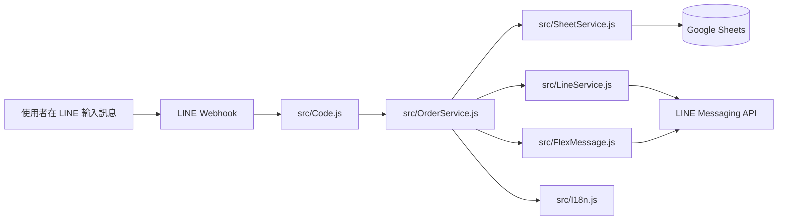

簡化來看，整體流程是：

1. 使用者在 LINE 傳訊息或點按鈕。
2. 請求進入 GAS 入口層。
3. `OrderService` 判斷這是一個什麼指令。
4. 需要資料就交給 `SheetService`。
5. 需要回覆卡片就交給 `FlexMessage`。
6. 需要發送或推播訊息就交給 `LineService`。

## 3. 核心模組對照表


| 模組                  | 角色     | 主要工作                                         |
| ----------------------- | ---------- | -------------------------------------------------- |
| `src/Code.js`         | 入口層   | 接收 webhook、處理試算表開啟事件、串接管理員功能 |
| `src/OrderService.js` | 流程中樞 | 解析指令、處理點餐/取消/查詢/統計/結單           |
| `src/SheetService.js` | 資料層   | 讀寫 Google Sheets、初始化表格、維護訂單與名冊   |
| `src/LineService.js`  | 通訊層   | 回覆訊息、推播通知、查詢 LINE 使用者資料         |
| `src/FlexMessage.js`  | UI 層    | 組裝菜單卡、統計卡、幫助卡與互動按鈕             |
| `src/I18n.js`         | 語系層   | 多語系文字、指令別名、使用者偏好語言             |
| `src/Config.js`       | 設定層   | 功能開關、預設值、工作表名稱、系統參數           |

## 4. 工作表對照


| 工作表            | 用途                                                     |
| ------------------- | ---------------------------------------------------------- |
| `Config`          | 儲存全域設定，例如是否開放點餐、截止時間、語系、開單人等 |
| `WeeklySchedule`  | 儲存週一到週五的店家排程與截止時間                       |
| `Menu`            | 儲存菜單品項、價格、分類、可用狀態                       |
| `Orders`          | 儲存每一筆訂單資料                                       |
| `Summary`         | 儲存或輸出統計結果                                       |
| `Children`        | 儲存使用者名下的小孩名冊                                 |
| `UserPreferences` | 儲存使用者個別語言偏好                                   |

### 4.1 資料欄位整理


| 工作表            | 欄位                                                                                                                                                                                   | 說明                                                                   |
| ------------------- | ---------------------------------------------------------------------------------------------------------------------------------------------------------------------------------------- | ------------------------------------------------------------------------ |
| `Config`          | `Key` / `Value` / `Description`                                                                                                                                                        | 系統設定鍵值、設定內容、說明文字                                       |
| `WeeklySchedule`  | `DayOfWeek` / `RestaurantName` / `CutoffTime` / `UberEatsUrl` / `Notes` / `IsActive`                                                                                                   | 每日排程、店家名稱、截止時間、匯入來源與啟用狀態                       |
| `Menu`            | `DayOfWeek` / `RestaurantName` / `Category` / `ItemName` / `Price` / `IsAvailable` / `Description`                                                                                     | 菜單所屬星期、店家、分類、品項、價格、可售與說明                       |
| `Orders`          | `OrderId` / `Timestamp` / `Date` / `DayOfWeek` / `GroupId` / `UserId` / `UserName` / `UserNickname` / `ChildName` / `ItemName` / `Quantity` / `Price` / `Subtotal` / `Status` / `Paid` | 訂單唯一編號、下單時間、日期、梯次、群組、使用者、小孩、品項與付款狀態 |
| `Summary`         | `DayOfWeek` / `RestaurantName` / `ItemName` / `Quantity` / `Price` / `Subtotal` / `Buyers`                                                                                             | 統計輸出資料，包含品項數量、金額與購買者                               |
| `Children`        | `UserId` / `UserName` / `UserNickname` / `ChildName` / `Note` / `CreatedAt` / `UpdatedAt`                                                                                              | 小孩名冊與備註、建立與更新時間                                         |
| `UserPreferences` | `UserId` / `Locale` / `UpdatedAt`                                                                                                                                                      | 使用者語系偏好與更新時間                                               |

### 4.2 重要設定欄位


| 設定鍵                   | 用途                 |
| -------------------------- | ---------------------- |
| `IS_ORDERING_OPEN`       | 是否開放點餐         |
| `RESTAURANT_NAME`        | 今日預設店家名稱     |
| `CUTOFF_TIME`            | 預設截止時間         |
| `ORGANIZER_ID`           | 開單人 LINE User ID  |
| `ORDER_RECEIPT_SCOPE`    | 點餐收據顯示範圍     |
| `CLOSE_ORDER_SCOPE`      | 結單範圍             |
| `ALLOW_SWITCH_ORGANIZER` | 是否允許切換開單人   |
| `USER_IDENTIFIER_MODE`   | 使用者識別模式       |
| `DEFAULT_LOCALE`         | 全域預設語系         |
| `ENABLE_USER_LOCALE`     | 是否允許個人語系偏好 |
| `ALLOW_WEEKEND_ORDERING` | 是否支援週末點餐     |

## 5. 指令與流程對照表


| 使用者指令                                               | 主要流程                   | 主要資料影響                  |
| ---------------------------------------------------------- | ---------------------------- | ------------------------------- |
| `幫助`、`說明`、`help`                                   | 顯示幫助卡與快捷按鈕       | 通常只讀設定，不寫入資料      |
| `設定語言`、`lang`                                       | 開啟語系選擇或直接切換語言 | `UserPreferences`             |
| `本週菜單`、`排程`                                       | 顯示本週排程卡             | `WeeklySchedule`              |
| `週X菜單`、`菜單 第X頁`                                  | 顯示指定日期或分頁菜單     | `WeeklySchedule`、`Menu`      |
| `匯入菜單`、`ubereats匯入`、`foodpanda匯入`、`nidin匯入` | 從外送平台抓取並匯入菜單   | `Menu`、`WeeklySchedule`      |
| `+1 餐點名`、`餐點名+1`、`週X 餐點+1`                    | 建立訂單                   | `Orders`                      |
| `取消`、`取消餐點`、`取消 我的 全部`                     | 取消單筆或多筆訂單         | `Orders`                      |
| `我的訂單`、`我的本週訂單`                               | 查詢個人今日或本週訂單     | `Orders`                      |
| `今日統計`、`統計`                                       | 顯示今日統計               | `Orders`、`Summary`           |
| `本週統計`、`梯次統計`                                   | 顯示本週統計               | `Orders`、`Summary`           |
| `結單`、`今日結單`、`本週結單`                           | 關閉點餐並產出結算資訊     | `Config`、`Orders`、`Summary` |
| `小孩選單`、`設定小孩`、`新增小孩`、`刪除小孩`           | 管理小孩名冊               | `Children`                    |

## 5.1 子功能流程圖

### 幫助與語系

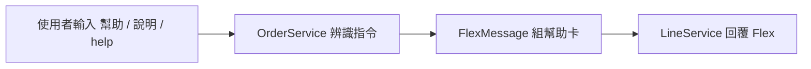

#### 語系切換

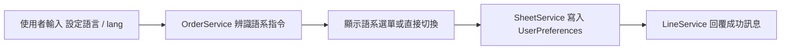

### 菜單查詢

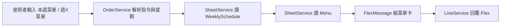

### 菜單匯入

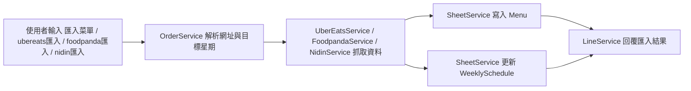

### 點餐

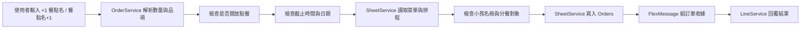

### 取消訂單

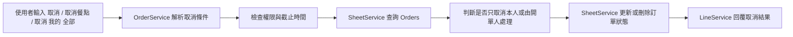

### 統計與查詢

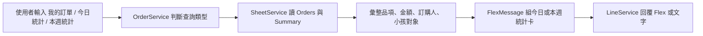

### 結單

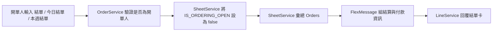

### 小孩管理

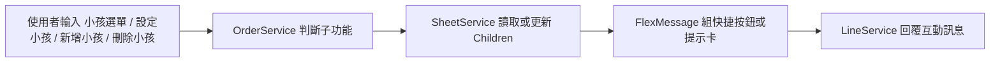

## 5.2 OrderService 內部分支流程圖

### 入口分派

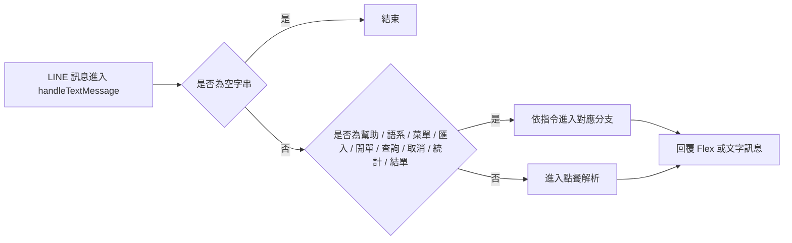

### 幫助與語系

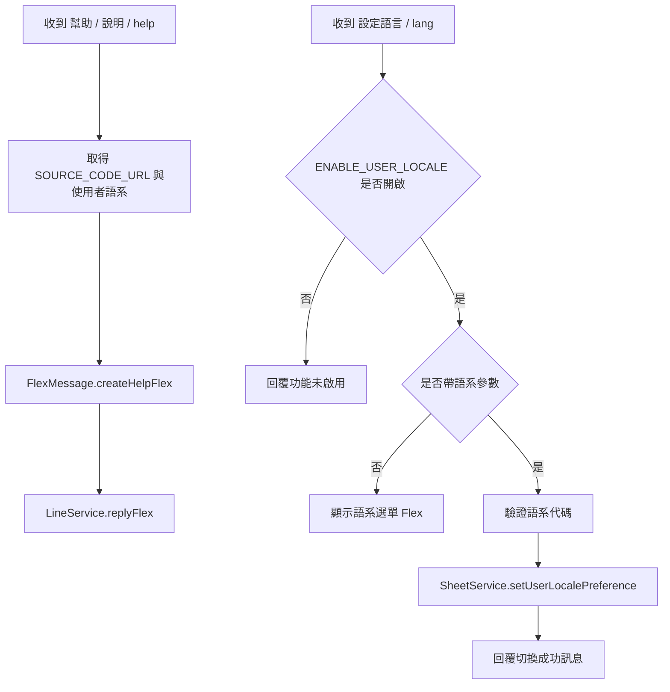

## 5.3 功能對應關係表

| 功能 | 主要入口 | 主要函式 | 主要資料表 | 回覆方式 |
|---|---|---|---|---|
| 幫助 | `OrderService` | 幫助分支 | `Config`、`SOURCE_CODE_URL` | Flex 卡 |
| 語系切換 | `OrderService` | 語系分支、`setUserLocalePreference` | `UserPreferences` | Flex 卡 / 文字 |
| 本週菜單 | `OrderService` | 週排程分支、`getWeeklySchedule`、`getMenuItems` | `WeeklySchedule`、`Menu` | Flex 卡 |
| 單日菜單 | `OrderService` | 單日菜單分支、`getScheduleByDay`、`getMenuItems` | `WeeklySchedule`、`Menu` | Flex 卡 |
| 菜單匯入 | `OrderService` | 匯入分支、`saveMenuItems`、`setWeeklyScheduleDay` | `Menu`、`WeeklySchedule` | 文字 |
| 點餐 | `OrderService` | 點餐分支、`parseOrderText`、`addOrder` | `Orders` | 收據 Flex / 文字 |
| 取消訂單 | `OrderService` | 取消分支、`getUserOrders`、`cancelOrder`、`cancelGroupOrders` | `Orders` | 文字 / Flex |
| 個人訂單查詢 | `OrderService` | 我的訂單 / 我的本週訂單分支、`getUserOrders` | `Orders` | 文字 |
| 今日統計 | `OrderService` | 今日統計分支、`getOrderSummary` | `Orders`、`Summary` | Flex 卡 / 文字 |
| 本週統計 | `OrderService` | 本週統計分支、`getWeeklyOrderSummary` | `Orders`、`Summary` | Flex 卡 |
| 結單 | `OrderService` | 結單分支、`setConfigValue`、`getOrderSummary`、`getWeeklyOrderSummary` | `Config`、`Orders`、`Summary` | Flex 卡 |
| 小孩管理 | `OrderService` | `setChildren`、`saveChild`、`deleteChild` | `Children` | Flex 卡 / 文字 |
| 管理員摘要更新 | `Code.js` | `refreshDailySummary`、`refreshWeeklySummary` | `Summary` | 試算表輸出 |
| 試算表初始化 | `SheetService` | `initSheets` | 全部工作表 | 試算表結構建立 |
  F -->|否| G[回覆功能未啟用]
  F -->|是| H{是否帶語系參數}
  H -->|否| I[顯示語系選單 Flex]
  H -->|是| J[驗證語系代碼]
  J --> K[SheetService.setUserLocalePreference]
  K --> L[回覆切換成功訊息]
```

### 菜單查詢

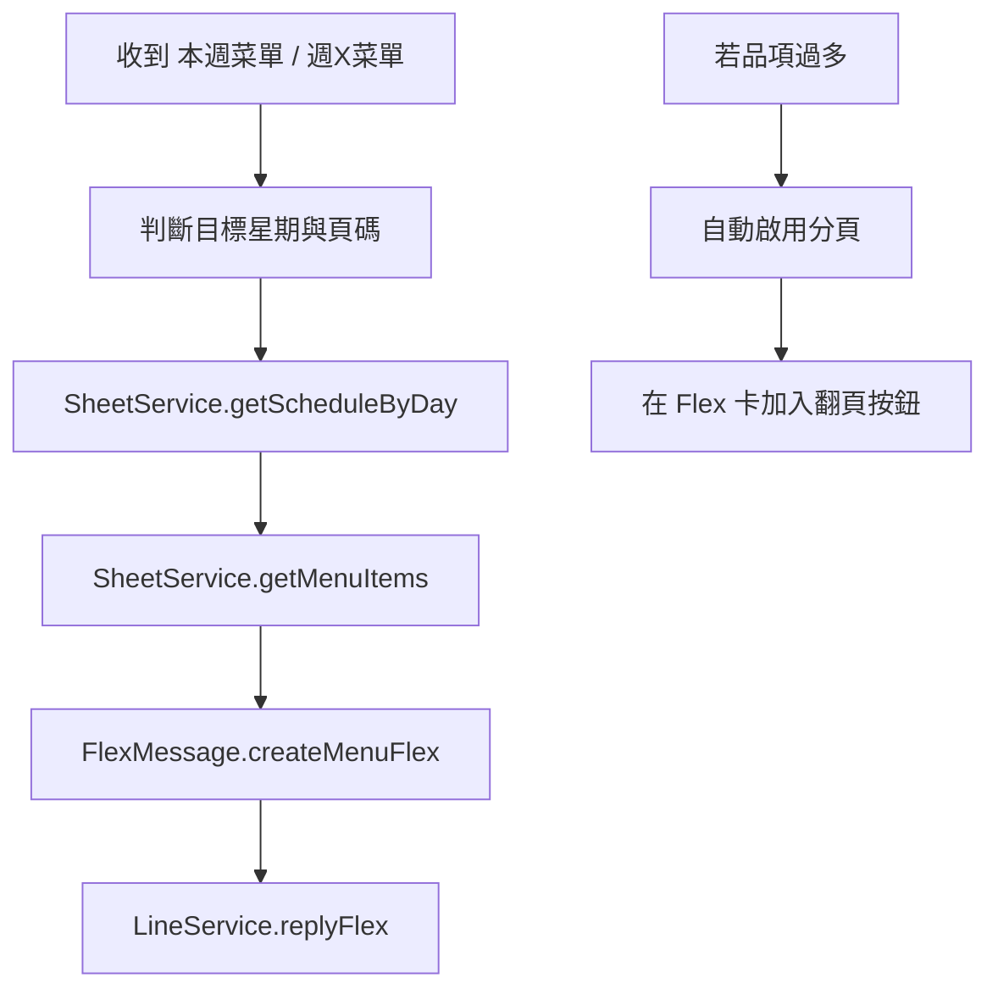

### 菜單匯入

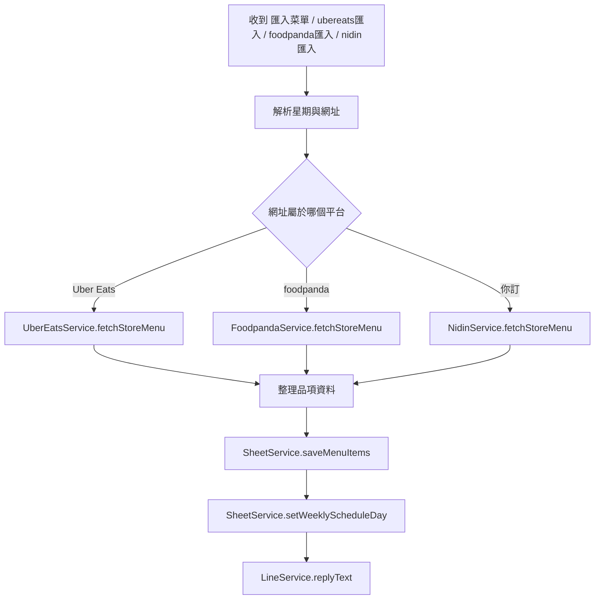

### 點餐

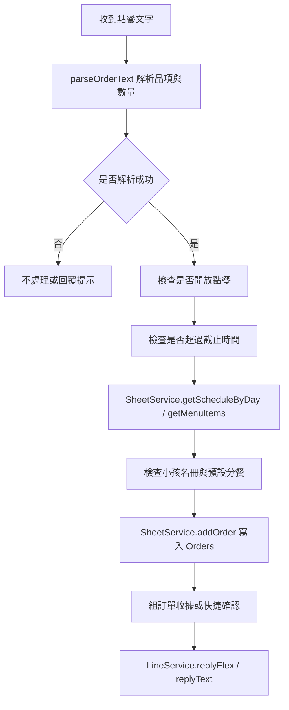

### 取消訂單

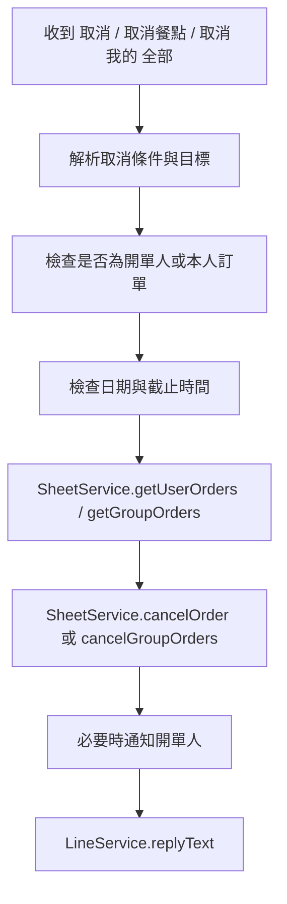

### 統計與查詢

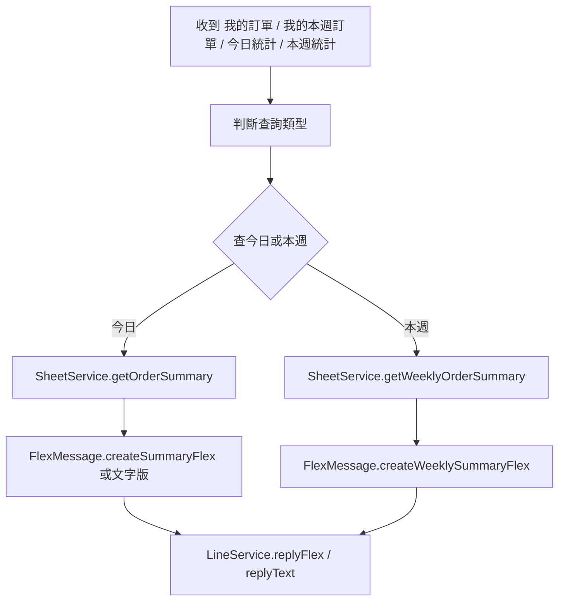

### 結單

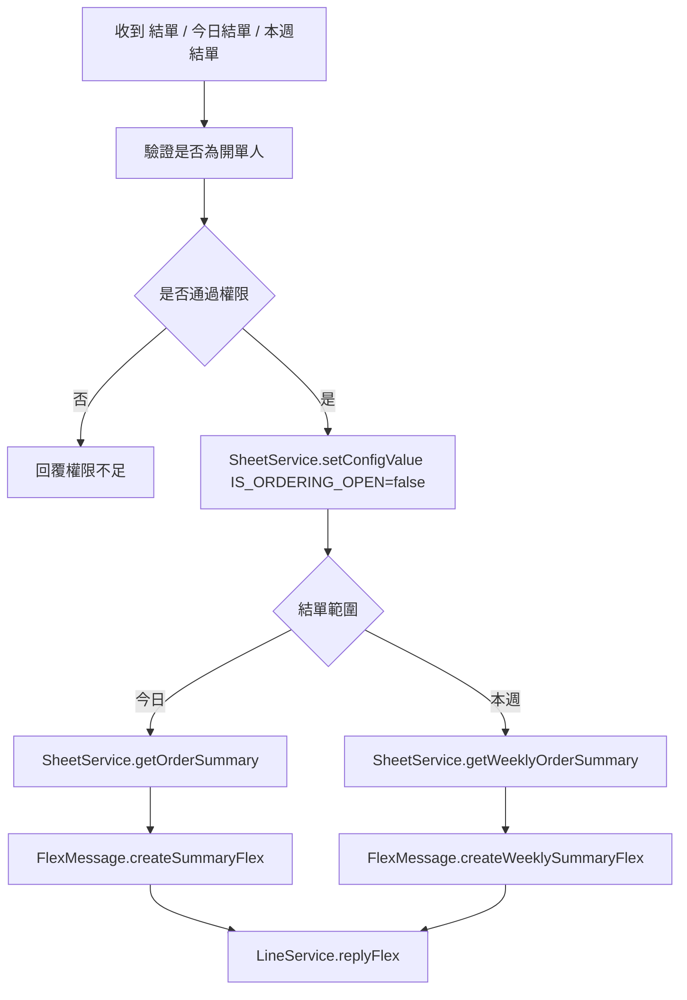

### 小孩管理

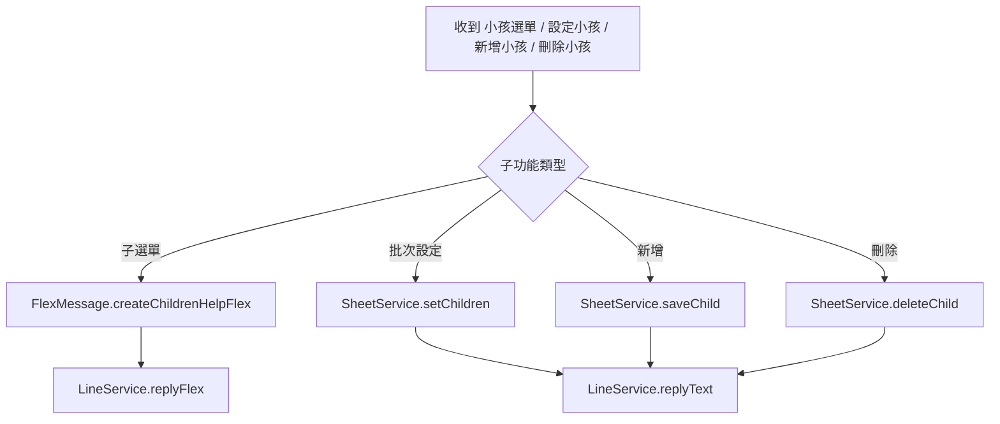

## 6. 開發與驗證

本地開發主要依靠兩個指令：

- `npm test`：執行測試套件，確認點餐、取消、統計等核心流程沒有壞掉。
- `npm run bundle`：把 `src/` 打包成 GAS 可貼上的單檔版本。

建議的開發順序是：

1. 先看 `README.md` 和 `src/Code.js`，建立整體入口概念。
2. 再看 `src/OrderService.js`，理解指令如何分派。
3. 接著看 `src/SheetService.js`，理解資料如何存取與統計。
4. 修改後先跑 `npm test`，再跑 `npm run bundle`。

## 7. 注意事項

- 這個專案的正式執行環境是 Google Apps Script，不是本地 Node.js。
- Google Sheets 直接當資料庫用，所以欄位與表格結構很重要。
- LINE Flex Message 有長度與元件數限制，菜單太長時需要分頁。
- 本地測試時若沒有設定 LINE 的 script properties，出現 `CHANNEL_ACCESS_TOKEN` 警告是正常現象。
- 外送平台菜單匯入可能受網站防護影響，需要注意爬取來源是否可用。

## 8. 後續開發建議

如果要開始改功能，建議優先從這三個方向著手：

1. 先整理一個你最想改的功能，例如點餐流程、統計樣式或小孩管理。
2. 找到對應的 `OrderService` 分支與 `SheetService` 寫入點。
3. 先補最小的測試，再做程式修改，避免影響其他流程。
