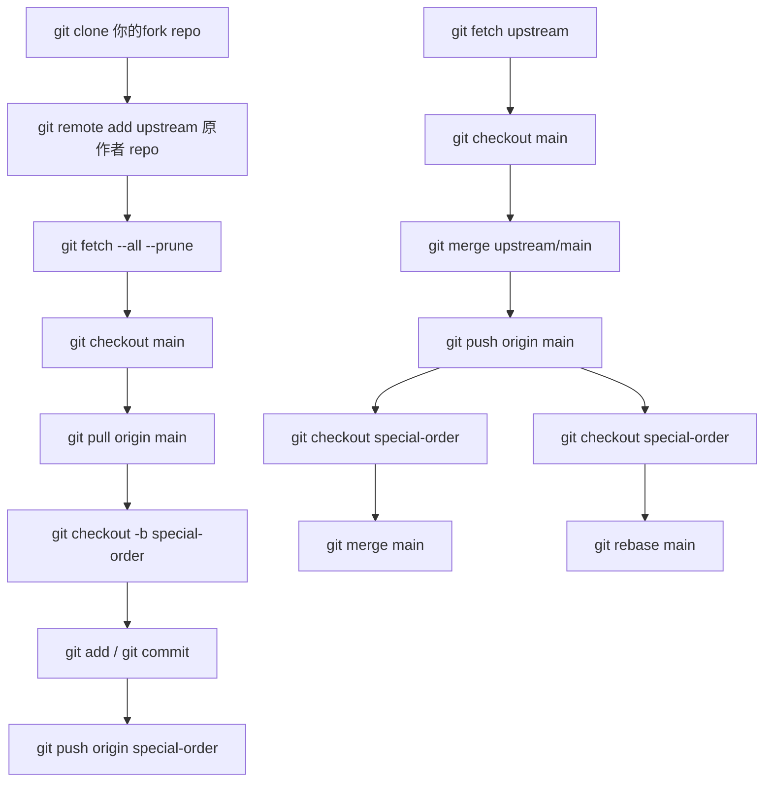

# Fork 專案第一次設定與同步流程

這份文件適用於「已經 fork 別人的 repo，並希望之後用 merge 同步原作者更新」的情境。

## 1. 你需要先準備的網址

請先把下面三個網址換成你自己的實際值：

- 原作者 repo：`https://github.com/macpaul/order-linebot.git`
- 你的 fork repo：`https://github.com/jacktea88/order-linebot.git`
- 主分支名稱：`main` 或 `master`

如果你不確定主分支名稱，先執行 `git branch` 看目前分支名稱。

## 2. 第一次 clone 與設定遠端

如果你還沒把 fork clone 到本機，先執行：

```bash
git clone https://github.com/jacktea88/order-linebot.git
cd LineBotGas
```

確認遠端：

```bash
git remote -v
```

如果 `origin` 已經是你的 fork，直接新增原作者遠端：

```bash
git remote add upstream https://github.com/macpaul/order-linebot.git
```

如果你當初是直接 clone 原作者 repo，之後才改成 fork 流程，則改成：

```bash
git remote rename origin upstream
git remote add origin https://github.com/jacktea88/order-linebot.git
```

抓取所有遠端資訊：

```bash
git fetch --all --prune
```

## 3. 之後日常開發的流程

建議每次都從主分支開功能分支：

```bash
git checkout main
git pull origin main
git checkout -b special-order
```

開發完成後提交：

```bash
git add .
git commit -m "你的修改說明"
```

推到你自己的 fork：

```bash
git push origin special-order
```

接著到 GitHub 上，從你的 fork 分支開 Pull Request 到原作者 repo。

## 4. 用 merge 同步原作者更新

這個專案建議採用 merge 同步，不用 rebase。流程如下：

```bash
git fetch upstream
git checkout main
git merge upstream/main
git push origin main
```

如果你的主分支叫 `master`，就把上面的 `main` 全部換成 `master`：

```bash
git fetch upstream
git checkout master
git merge upstream/master
git push origin master
```

## 5. 常用檢查指令

查看目前遠端：

```bash
git remote -v
```

查看目前分支：

```bash
git branch
```

查看同步狀態：

```bash
git status
```

查看最近提交：

```bash
git log --oneline --decorate -n 10
```

## 6. 這個專案的實務建議

- 平常修改都在功能分支上做，不要直接在主分支改。
- 同步原作者更新時，用 merge 比較安全，不會改寫歷史。
- 推送時，自己的修改推到 `origin`，原作者更新只從 `upstream` 拉。
- 若你有改 `dist/Code.gs`、`README.md` 或測試檔，建議先跑 `npm test` 與 `npm run bundle` 再推送。

## 7. 可直接複製的模板

把下面內容中的網址換掉即可使用：

```bash
git clone https://github.com/jacktea88/order-linebot.git
cd LineBotGas
git remote add upstream https://github.com/macpaul/order-linebot.git
git fetch --all --prune

git checkout main
git pull origin main
git checkout -b special-order
# 開發、提交後
git push origin special-order

# 同步原作者更新
git fetch upstream
git checkout main
git merge upstream/main
git push origin main
```

如果主分支是 `master`，把 `main` 全部替換成 `master` 即可。

## 8. 實際指令版流程圖



這張圖對應的意思是：

- 前半段是第一次設定與日常開發
- 中段是把原作者更新合回你的 `main`
- 後半段是讓既有功能分支也跟著吃到更新
- 如果你不想改寫歷史，就用 `git merge main`
- 如果你想保持線性提交記錄，就用 `git rebase main`

## 9. 可直接照打的終端機指令範例

下面這份範例以這個專案為例，假設：

- 你的 fork repo：`https://github.com/jacktea88/order-linebot.git`
- 原作者 repo：`https://github.com/macpaul/order-linebot.git`
- 主分支名稱：`main`

```bash
git clone https://github.com/jacktea88/order-linebot.git
cd LineBotGas

git remote add upstream https://github.com/macpaul/order-linebot.git
git fetch --all --prune

git checkout main
git pull origin main
git checkout -b special-order

# 開發完成後
git add .
git commit -m "你的修改說明"
git push origin special-order

# 之後要同步原作者更新時
git fetch upstream
git checkout main
git merge upstream/main
git push origin main

# 如果某個功能分支也要吃到最新 main
git checkout special-order
git merge main
```

如果你的主分支是 `master`，就把上面的 `main` 全部換成 `master` 即可。

## 10. 一頁式最短版

```bash
# 先把 fork 抓到本機
git clone https://github.com/jacktea88/order-linebot.git
cd LineBotGas

# 設定原作者遠端
git remote add upstream https://github.com/macpaul/order-linebot.git
git fetch --all --prune

# 平常開發
git checkout main
git pull origin main
git checkout -b special-order
# ...修改檔案...
git add .
git commit -m "你的修改說明"
git push origin special-order

# 同步原作者更新
git fetch upstream
git checkout main
git merge upstream/main
git push origin main

# 讓功能分支也吃到最新更新
git checkout special-order
git merge main
```

如果主分支是 `master`，把上面的 `main` 全部換成 `master` 即可。
